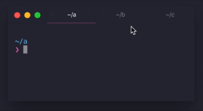

# Drag and drop tabs for hyper terminal



# Installing

Add "hyper-dnd-tabs" to the plugins section of ~/.hyper.js:

```
    plugins: ["hyper-dnd-tabs"]
```

## Using

You must use the handle to drag the tab. Or you can use the keyboard, `command+shift+left`
and `command+shift+right`.
